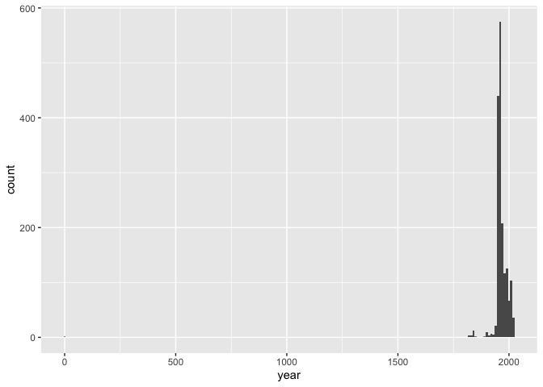
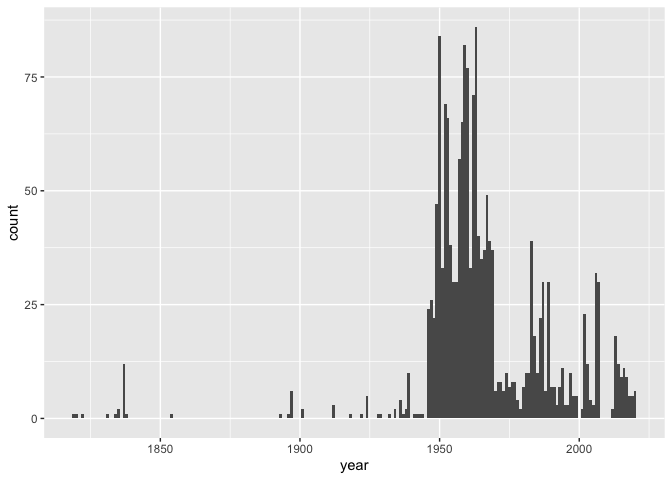

Lab 08 - University of Edinburgh Art Collection
================
Noah Booker
4/4/25

## Load Packages and Data

First, let’s load the necessary packages:

``` r
library(tidyverse) 
library(skimr)
```

Checking whether bots are allowed to access pages on this domain.

``` r
library(robotstxt)
paths_allowed("https://collections.ed.ac.uk/art)")
```

    ##  collections.ed.ac.uk

    ## [1] TRUE

Now, load the dataset. If your data isn’t ready yet, you can leave
`eval = FALSE` for now and update it when needed.

``` r
uoe_art <- read_csv("data/uoe-art.csv")
```

## Exercise 9

Let’s start working with the **title** column by separating the title
and the date:

``` r
uoe_art <- uoe_art %>%
  separate(title, into = c("title", "date"), sep = "\\(") %>%
  mutate(year = str_remove(date, "\\)") %>% as.numeric()) %>%
  select(title, artist, year, link)  # Fill in the missing variable!
```

    ## Warning: Expected 2 pieces. Additional pieces discarded in 48 rows [2, 85, 113, 183,
    ## 204, 260, 498, 578, 585, 757, 847, 863, 991, 1005, 1208, 1255, 1304, 1360,
    ## 1380, 1409, ...].

    ## Warning: Expected 2 pieces. Missing pieces filled with `NA` in 696 rows [7, 10, 13, 17,
    ## 21, 23, 25, 26, 27, 33, 43, 46, 51, 53, 54, 56, 62, 65, 68, 71, ...].

    ## Warning: There was 1 warning in `mutate()`.
    ## ℹ In argument: `year = str_remove(date, "\\)") %>% as.numeric()`.
    ## Caused by warning in `str_remove(date, "\\)") %>% as.numeric()`:
    ## ! NAs introduced by coercion

## Exercise 10

Note that this approach will result in some warnings when you run the
code, and that’s OK! Read the warnings, and explain what they mean, and
why we are ok with leaving them in given that our objective is to just
capture year where it’s convenient to do so.

It seems that the first warning is referring to titles that have
parentheticals before the date, such as piece number 2, A World under
Your Feet/ Composition with Yellow Crosses (diptych) (1990), and piece
number 85, Frieze from the Temple of Athena Nike (left slab) (1827). In
those cases, the code above does not serve our purposes—it removes an
informative element of the title and does not extract the date.

The second warning, I think, is warning us that the mutate function is
returning some NA values. For the pieces with titles without dates, this
is fine. However, as explained above, I think this also includes some
titles with dates as well.

## Exercise 11

Print out a summary of the data frame using the skim() function. How
many pieces have artist info missing? How many have year info missing?

``` r
skim(uoe_art)
```

|                                                  |         |
|:-------------------------------------------------|:--------|
| Name                                             | uoe_art |
| Number of rows                                   | 3312    |
| Number of columns                                | 4       |
| \_\_\_\_\_\_\_\_\_\_\_\_\_\_\_\_\_\_\_\_\_\_\_   |         |
| Column type frequency:                           |         |
| character                                        | 3       |
| numeric                                          | 1       |
| \_\_\_\_\_\_\_\_\_\_\_\_\_\_\_\_\_\_\_\_\_\_\_\_ |         |
| Group variables                                  | None    |

Data summary

**Variable type: character**

| skim_variable | n_missing | complete_rate | min | max | empty | n_unique | whitespace |
|:--------------|----------:|--------------:|----:|----:|------:|---------:|-----------:|
| title         |         0 |          1.00 |   0 |  95 |     5 |     1629 |          0 |
| artist        |       111 |          0.97 |   2 |  55 |     0 |     1198 |          0 |
| link          |         0 |          1.00 |  57 |  60 |     0 |     3312 |          0 |

**Variable type: numeric**

| skim_variable | n_missing | complete_rate |    mean |    sd |  p0 |  p25 |  p50 |  p75 | p100 | hist  |
|:--------------|----------:|--------------:|--------:|------:|----:|-----:|-----:|-----:|-----:|:------|
| year          |      1575 |          0.52 | 1964.56 | 53.14 |   2 | 1953 | 1962 | 1977 | 2020 | ▁▁▁▁▇ |

There are 111 pieces without artist info and 1,575 pieces without year
info.

## Exercise 12

Make a histogram of years. Use a reasonable bin width. Do you see
anything out of the ordinary?

``` r
uoe_art %>% 
  ggplot(aes(x = year)) +
  geom_histogram(binwidth = 10)
```

    ## Warning: Removed 1575 rows containing non-finite outside the scale range
    ## (`stat_bin()`).

<!-- -->

There seems to be at least one data point near year 0.

## Exercise 13

Find which piece has the out-of-the-ordinary year and go to its page on
the art collection website to find the correct year for it. Can you tell
why our code didn’t capture the correct year information? Correct the
error in the data frame and visualize the data again.

Piece number 1871 originally had the title Death Mask (2) (1964). Our
code to extract the year instead extracted 2 because it’s the numeric
value that appeared after the first open parentheses.

``` r
uoe_art <- uoe_art %>%
  mutate(year = if_else(row_number() == 1871, 1964, year))

uoe_art %>% 
  ggplot(aes(x = year)) +
  geom_histogram(binwidth = 1)
```

    ## Warning: Removed 1575 rows containing non-finite outside the scale range
    ## (`stat_bin()`).

<!-- -->

## Exercise 14

Who is the most commonly featured artist in the collection? Do you know
them? Any guess as to why the university has so many pieces from them?

``` r
uoe_art %>% 
  count(artist) %>%
  arrange(desc(n)) %>% 
  head()
```

    ## # A tibble: 6 × 2
    ##   artist               n
    ##   <chr>            <int>
    ## 1 Unknown            373
    ## 2 Emma Gillies       175
    ## 3 <NA>               111
    ## 4 Ann F Ward          23
    ## 5 John Bellany        22
    ## 6 Zygmunt Bukowski    21

The most common artist is Emma Gillies. Wikipedia says that “Emma Smith
Gillies (1900–1936) was a Scottish potter best known for her early
adaptation of Art Deco painted vases and jugs.” It also says that was
born near Edinburhg, attended pottery classes at Edinburgh College of
Art, studying there under a renowned sculptor, and that some of her work
was discovered (posthumously) at University of Edinburgh in 2012.
